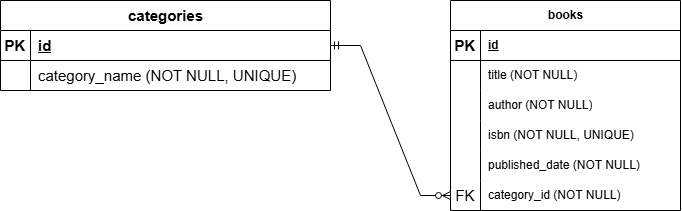

# springboot-microservice-task-fedrik-pangestu

A simple Book Management Microservice built with Spring Boot 4.0.6. This project implements full CRUD operations for Books and Categories using RESTful API design, PostgreSQL as the database, and follows clean architecture with feature-based modular structure.

---

## Tech Stack

- **Java** 21 LTS
- **Spring Boot** 4.0.6
- **Spring Data JPA** + Hibernate
- **PostgreSQL**
- **Maven**
- **Postman** (for API testing)

---

## Project Structure

```
src/main/java/com/fedrikp/
├── dto/
│   ├── book/
│   │   ├── BookRequestDTO.java
│   │   └── BookResponseDTO.java
│   ├── category/
│   │   ├── CategoryRequestDTO.java
│   │   └── CategoryResponseDTO.java
│   └── error/
│       └── ErrorResponse.java
├── entity/
│   ├── Book.java
│   └── Category.java
├── exception/
│   ├── BadRequestException.java
│   ├── DuplicateResourceException.java
│   ├── GlobalExceptionHandler.java
│   └── ResourceNotFoundException.java
└── feature/
    ├── book/
    │   ├── impl/
    │   │   └── BookServiceImpl.java
    │   ├── BookController.java
    │   ├── BookRepository.java
    │   └── BookService.java
    └── category/
        ├── impl/
        │   └── CategoryServiceImpl.java
        ├── CategoryController.java
        ├── CategoryRepository.java
        └── CategoryService.java
```

---

## Prerequisites

Make sure you have the following installed:

- [Java 21 LTS](https://www.oracle.com/java/technologies/downloads/)
- [Maven](https://maven.apache.org/download.cgi) (or use the included `mvnw`)
- [PostgreSQL](https://www.postgresql.org/download/)
- [Postman](https://www.postman.com/downloads/)

---

## Database Setup

Create a PostgreSQL database before running the application:

```sql
CREATE DATABASE book_management;
```

---

## Environment Variables

This project uses `application.properties` for configuration. Create or update `src/main/resources/application.properties` with your PostgreSQL credentials:

```properties
spring.datasource.url=jdbc:postgresql://localhost:5432/book_management
spring.datasource.username=your_username
spring.datasource.password=your_password

spring.jpa.hibernate.ddl-auto=update
spring.jpa.show-sql=true
spring.jpa.properties.hibernate.dialect=org.hibernate.dialect.PostgreSQLDialect

server.port=8080
```

> **Note:** In a production environment, credentials should be stored as environment variables and never hardcoded or committed to version control.

---

## How to Run

**Option 1 — Using Maven Wrapper (Terminal):**

Windows:
```cmd
mvnw.cmd spring-boot:run
```

Linux / Mac:
```bash
./mvnw spring-boot:run
```

**Option 2 — Using Spring Tool Suite (STS):**
```
Right-click project → Run As → Spring Boot App
```

Once started, the application runs at:
```
http://localhost:8080
```

---

## API Endpoints

### Category

| Method | Endpoint | Description |
|--------|----------|-------------|
| POST | `/api/categories` | Create a new category |
| GET | `/api/categories` | Get all categories |
| GET | `/api/categories/{id}` | Get category by ID |
| PUT | `/api/categories/{id}` | Update category by ID |
| DELETE | `/api/categories/{id}` | Delete category by ID |

### Book

| Method | Endpoint | Description |
|--------|----------|-------------|
| POST | `/api/books` | Create a new book |
| GET | `/api/books` | Get all books |
| GET | `/api/books/{id}` | Get book by ID |
| PUT | `/api/books/{id}` | Full update of a book |
| PATCH | `/api/books/{id}` | Partial update of a book |
| DELETE | `/api/books/{id}` | Delete a book |

---

## Sample Requests

### Create Category
```http
POST /api/categories
Content-Type: application/json

{
  "categoryName": "Programming"
}
```

### Create Book
```http
POST /api/books
Content-Type: application/json

{
  "title": "Clean Code",
  "author": "Robert C. Martin",
  "isbn": "9780132350884",
  "publishedDate": "2008-08-01",
  "categoryId": 1
}
```

### Partial Update Book (PATCH)
```http
PATCH /api/books/1
Content-Type: application/json

{
  "title": "Clean Code (Updated)"
}
```

---

## Error Responses

All errors return a consistent JSON format:

```json
{
  "status": 404,
  "message": "Book not found with id: 1"
}
```

| Status Code | Description |
|-------------|-------------|
| 400 | Bad Request - missing or invalid fields |
| 404 | Not Found - resource does not exist |
| 409 | Conflict - duplicate data (e.g. ISBN already exists) |

---

## Postman Collection

The API collection is available in two ways:

**Option 1 — Import from file:**
Import the collection file located at:
`postman/springboot-microservice-task-fedrik-pangestu.postman_collection.json`

**Option 2 — Access via Postman Web:**
[Open Postman Collection](https://www.postman.com/tokopulaubarupinyuh-7631607/springboot-microservice-task-fedrik-pangestu/collection/7zkzt0e/springboot-microservice-task-fedrik-pangestu?action=share&source=copy-link&creator=55811656)


After importing, set the `BaseURL` collection variable to:
```
http://localhost:8080
```

---

## ER Diagram

```

One category can have many books. A book must belong to one category.
